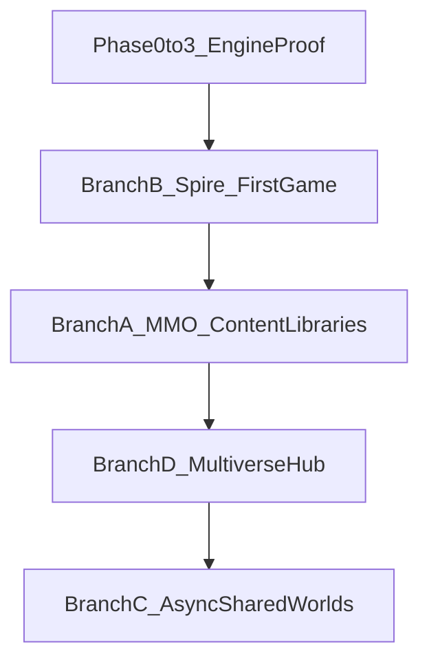

# Playable Worlds Lab — Vision, Branches, and MMO Gap Analysis

**Created:** 2026-05-30  
**Purpose:** Pick up later — consolidates project review, long-term vision, realistic product branches, gap analysis, and a question bank to resolve inconsistencies.  
**Status:** Strategic planning doc — **not** a step tracker override. Implementation still follows [Playable_Worlds_Lab_v4_1_Notion_Step_Tracker.csv](../Playable_Worlds_Lab_v4_1_Notion_Step_Tracker.csv).

**Related docs:**

- [AGENT_SESSION_HANDOFF.md](../AGENT_SESSION_HANDOFF.md) — current build state and agent rules
- [README.md](../README.md) — product spec
- [Future_Features/README.md](../Future_Features/README.md) — future feature index
- [Playable_Worlds_Lab_v4_1_FULL_CURSOR.md](../Playable_Worlds_Lab_v4_1_FULL_CURSOR.md) — authoritative step cards

---

## 1. Project snapshot (as of 2026-09-20)

### What this is

Playable Worlds Lab is a **text-first, schema-first game engine** where:

- Players make story choices (e.g. fight, trick, or sneak past an ogre).
- The game **remembers** what happened (World Ledger).
- AI can **suggest** next beats, NPC reactions, and pacing — but **cannot** change permanent world truth directly.
- Everything runs through Zod schemas, validators, and tests first.

**Core mantra:** AI proposes → Validators check → The game engine executes.

**First proof content:** Stonepass Spire — Floor 1 (legacy file `stonepass-valley.world.json`).

### Build status

| Area                                   | Status                                                  |
| -------------------------------------- | ------------------------------------------------------- |
| Phase 0 — Schemas & foundation         | **Complete** (16/16)                                    |
| Phase 1 — Text game runtime            | **Complete**                                            |
| Phase 2 — AI Director v1               | **Complete**                                            |
| Phase 3 — Cave instances & progression | **In progress** (W5-S1–S8 done)                         |
| Tests                                  | **410 passing** (74 files)                              |
| Browser play (`/play`)                 | Ogre bridge, ledger, debug, Director reasoning panel    |
| **Next approved step**                 | **W5-S9** — clamped `progressionChanges` on Consequence |

### Architecture (mental model)

```text
packages/content (JSON worlds)
    → packages/core (deterministic engine)
        → apps/web (thin UI)
    ↑
packages/ai (advisory gateway + agents)
```

### Main gap today

**The browser lags behind the engine.**

- `/play` shows the ogre bridge and main-world loop.
- Cave → puzzle → dragon awakening works in **integration tests**, not yet in the **UI**.
- Beat progression is partial on some ogre paths.
- AI Director shows suggestions but does not auto-apply them (by design for now).

**Rough MVP progress:** ~60–70% through Floor 1 proof. Foundation is solid; player-facing experience needs to catch up.

---

## 2. User-stated long-term goals

From product direction discussions (2026-05-30):

- Build game(s) that feel **MMO-like**
- Rely on **libraries of standard MMO features** (NPCs, creatures, items, encounters)
- Support **multiple world creation**
- Use an **AI Director** for live, adaptive experiences
- Long-term: next-gen experience with validated worlds, not prompt chaos

---

## 3. Central tension to resolve

| What you want           | What docs say today                                     |
| ----------------------- | ------------------------------------------------------- |
| MMO-like games          | No real-time multiplayer until single-player proof      |
| Standard MMO libraries  | Planned Phase 5+ (W7-S7–S11), not built yet             |
| Multiple world creation | WorldBlueprint + Architect planned, not built yet       |
| AI Director             | Built (advisory); auto-apply policy not decided         |
| Full RPG feel           | Tier A only (bounded tiers); Tier B (XP/stats) deferred |

**This is not a dead end.** The engine is built for **MMO foundations** (libraries, persistence, shared worlds, Director). It **defers MMO live complexity** until single-player proof is solid.

**Key decision:** Pick **which kind of MMO** this becomes — real-time action, async persistent, or hub multiverse — because "MMO" covers very different products.

---

## 4. Realistic product branches

Each branch uses the existing engine. None require a rewrite.

### Branch A — MMO Content Kit (libraries-first)

**What:** Validated library of MMO building blocks — creatures, NPC archetypes, encounters, items, puzzles, quest blueprints — tagged and reusable across worlds.

**Player/creator experience:** Assemble lava/ocean/machine worlds from library entries. Same engine, different tags.

**Docs:** [Player_World_Generation_and_Content_Libraries.md](../Future_Features/Player_World_Generation_and_Content_Libraries.md) · Tracker W7-S7–S11

**Outcome:** RPG/MMORPG **authoring platform** that powers many games — closest match to "standard MMO feature library."

---

### Branch B — Stonepass Spire as first shipped game

**What:** Flagship 100-floor tower (Aincrad-style). Each floor = `WorldDefinition`. Text-first → 2D later.

**Experience:** Solo climb, train-by-doing skills, gear-gated bosses, AI Director pacing. Feels like solo MMO raid ladder.

**Docs:** [Stonepass_Spire_Aincrad_Castle.md](../Future_Features/Stonepass_Spire_Aincrad_Castle.md) · Tracker W5-S13, W8-S15–S17, W9-S7

**Outcome:** Polished **single-player RPG** that proves every system before multiplayer.

---

### Branch C — Async "correspondence MMO"

**What:** Multiple players share one world's ledger via **turn-based async** play — not real-time WoW combat.

**Experience:** Friends affect the same world over days. Deterministic merge rules. Invite-only co-op. Optional "guide/DM" role (proposes like Director, cannot write truth).

**Docs:** [Async_Shared_Worlds_and_Asymmetric_Coop.md](../Future_Features/Async_Shared_Worlds_and_Asymmetric_Coop.md)

**Outcome:** First true **multiplayer** without MMO netcode. Persistent shared world MMO, not action MMO.

---

### Branch D — Multiverse hub MMO

**What:** World Hub + World Passport. One identity travels between worlds via portals. Trophies, badges, cross-world quests.

**Experience:** OASIS-lite — network of controlled worlds, not one seamless open map.

**Docs:** README Future Vision section

**Outcome:** **Meta-MMO** — the MMO is hub + identity, not one giant zone.

---

### Branch D2 — Creator multiverse (validated UGC)

**What:** Players create themed worlds via WorldBlueprint + libraries. Curated publish pipeline (health score, AI playtester, review).

**Experience:** Browse safe player worlds. Play, remix, fork. Director runs inside bounds.

**Docs:** Quest generation, WorldArchitect, [Curator_and_Community_Library_Contributions.md](../Future_Features/Curator_and_Community_Library_Contributions.md)

**Outcome:** **UGC MMO platform** — curated and schema-safe, not chaotic prompt soup.

---

### Branch E — AI Director live ops

**What:** Seasons, events, difficulty tuning, regional quest weaving — all clamped to authored blueprints.

**Experience:** Same world feels different each season. Loot/completion rules never drift.

**Docs:** [Dynamic_Difficulty_Director.md](../Future_Features/Dynamic_Difficulty_Director.md), [Emergent_Goal_and_Director_Quest_Weaving.md](../Future_Features/Emergent_Goal_and_Director_Quest_Weaving.md)

**Outcome:** **Next-gen live service** — AI as ops layer, not cheat engine.

---

### Branch F — Simulated-population MMO feel

**What:** Solo play with **social residue** — async traces of other players (cleared flags, message shrines, market boards).

**Experience:** World feels populated without real-time sync (Dark Souls messages, Death Stranding signs pattern).

**Outcome:** Low-cost MMO atmosphere before full multiplayer infrastructure. **Not documented in repo yet** — needs new spec if chosen.

---

### Branch G — Engine-as-product (SDK)

**What:** Package `@playable-worlds/core` + `@playable-worlds/ai` + libraries for other studios.

**Outcome:** Revenue without operating a live MMO yourself. Risk: diverges from shipping your own game.

---

### Recommended combo path

```text
Short term:   Branch B — playable Spire (Floor 1 end-to-end in browser)
Medium term:  Branch A — MMO content libraries
Long term:    Branch D + C — hub identity + async shared worlds
Differentiator woven through: Branch E — AI Director live ops
```



---

## 5. Gaps and inconsistencies in current docs

| Gap                      | Docs say                        | User direction          | Needs resolution                                                   |
| ------------------------ | ------------------------------- | ----------------------- | ------------------------------------------------------------------ |
| **"MMO" definition**     | Async co-op maybe; no real-time | MMO-like                | Pick: async persistent, hub multiverse, or real-time (major pivot) |
| **Multiplayer**          | Blocked until SP works          | Multi-world + social    | Async first vs real-time later                                     |
| **Economy**              | No full economy                 | MMO features            | Tier A flags/tiers only, or amend for currency/trading             |
| **Combat/progression**   | Tier A bounded; Tier B deferred | RS-style train-by-doing | Is Tier A enough for v1? When to promote Tier B?                   |
| **Spire vs multiverse**  | Spire = single-player flagship  | Multiple worlds         | Is Spire one world in the hub, or the whole product?               |
| **Director power**       | Suggest only                    | AI-driven MMO           | Which actions auto-apply vs stay advisory?                         |
| **UGC safety**           | Curated, no marketplace chaos   | Player world creation   | Open vs invite-only vs staff-curated                               |
| **Visual timing**        | After text proof                | MMO feel needs visuals  | When is 2D/3D mandatory for target audience?                       |
| **Platform**             | Next.js web                     | MMO scale               | Web-only vs desktop/native client                                  |
| **Server architecture**  | Supabase mentioned              | Persistence + MP        | No authoritative game server design yet                            |
| **Spire doc vs Phase 2** | Spire: no AI NPC dialogue       | NPCReactionAgent exists | Policy for generated worlds vs Spire flagship                      |
| **README drift**         | Slightly stale in places        | —                       | Sync with handoff after milestones                                 |

---

## 6. Proposed product decisions (pending human confirmation)

Based on stated user goals + recommended path. **Edit this section when you decide.**

| #   | Question                          | Proposed answer                                                                                          | Confirmed? |
| --- | --------------------------------- | -------------------------------------------------------------------------------------------------------- | ---------- |
| 1   | What kind of MMO?                 | **Hub multiverse + async shared worlds first** — not real-time action MMO on day one                     | ☐          |
| 2   | Platform or one game?             | **Both:** engine/platform long-term; **Stonepass Spire** as first flagship game inside the hub           | ☐          |
| 8   | Real-time multiplayer?            | **Later phase** — async co-op is first multiplayer milestone                                             | ☐          |
| 17  | Currency needed?                  | **Not v1** — tier/flag-based rewards (Tier A); revisit when hub economy is spec'd                        | ☐          |
| 27  | Who builds first library content? | **You manually** for Stonepass theme pack, then AI-assisted batch within validation bounds               | ☐          |
| 37  | Director auto-apply?              | **Phased:** stay advisory through Phase 3; auto-apply `select_next_beat` only after playtest gate passes | ☐          |
| 46  | One character across worlds?      | **Yes (World Passport)** — long-term; session-local only until Phase 6 persistence                       | ☐          |
| 71  | Spire no-multiplayer rule         | **Applies to Spire flagship only** — whole product can add async MP via Branch C                         | ☐          |

---

## 7. Question bank (answer to flesh out vision)

Skip what does not apply. **Start with questions 1, 2, 8, 17, 27, 37, 46, 71** — they unlock most other answers.

### A. Product identity and north star

1. When you say "MMO," do you mean real-time action, persistent async shared world, or hub + instanced worlds?
2. Is Playable Worlds Lab the **platform** or **one flagship game** (Spire)?
3. In 3 years, success = daily players in one game, creators publishing worlds, engine licensed, or other?
4. Who is the first real user: you, friends, public players, or creators?
5. Is text-first a dev strategy (temporary) or permanent product identity?
6. Closest "this but better" reference game?
7. Would you ship a fun single-player Spire if multiplayer took 2 more years?

### B. Multiplayer and social

8. Real-time multiplayer: never, later, or core requirement?
9. Max players per shared world at launch: 1, 2–8 async, 50 async, 100+ real-time?
10. Is PvP ever in scope?
11. Guilds/clans/parties: required or optional?
12. Chat: async text, emotes, or voice?
13. Async co-op: turn order (Model A) or branch+merge (Model B)?
14. Strangers in a hub or invite links only?
15. Griefing policy: rollback, host veto, permissions?
16. Guide/DM player role: yes or co-op equals only?

### C. Economy, items, and MMO systems

17. Currency needed or tier/flag rewards enough?
18. Player-to-player trading?
19. Auction house / marketplace ever?
20. Inventory: item IDs + quantities vs flag-based gear tiers?
21. Tier A vs Tier B: when is continuous XP required for "real MMO feel"?
22. Crafting needed?
23. Loot tables: authored, generated, or hybrid?
24. Gear degradation / repair?
25. Death penalty: none, drop, XP loss, permadeath?
26. Top 10 must-have v1 MMO features vs nice v2?

### D. Content libraries and world creation

27. Who builds first library content?
28. Minimum library size before "lava world" feels good?
29. Global library pool or per-theme packs?
30. Can players upload custom creatures/NPCs?
31. WorldBlueprint knobs players must control?
32. How much of a new world is AI-generated vs hand-placed?
33. One WorldDefinition per zone or one file per continent?
34. Region stitching: linear (Spire), open overworld, or both?
35. Quest generation: standalone, embedded, or both?
36. AI playtester required before every publish?

### E. AI Director and agents

37. When should Director auto-apply beat selection vs stay advisory?
38. Can Director spawn temporary instances mid-session without approval?
39. Director rewrite NPC dialogue every turn or pick from variant pools?
40. Director run live ops in production?
41. WorldArchitect vs Director: same provider and safety rules?
42. AI Playtester blocking broken worlds before players see them?
43. How visible is AI reasoning to players?
44. Fallback when AI fails: FakeProvider stubs or hard-stop?
45. Multi-agent priority: NPC memory, critic loop, quest weaver?

### F. Persistence, identity, and cross-world

46. One character across all worlds or fresh per world?
47. What persists: skills, gear, flags, relationships?
48. Cross-world items allowed?
49. Save model: cloud, local, or both?
50. Fork/remix alternate timelines?
51. What happens to in-progress saves when author patches world?
52. Seasonal resets per world?

### G. Presentation and platform

53. When is 2D map view required for retention?
54. Target platforms: browser, desktop, mobile, console?
55. Combat: text choices, 2D animated, or 3D action?
56. Art: AI-generated, curated packs, or user uploads?
57. TTS/voice: marketing or core?
58. Performance target: 60fps 3D or text/2D for years?

### H. Business, safety, and ops

59. Monetization model?
60. UGC publish: open, apply-to-curate, or staff-only?
61. Teen vs adult: separate hubs or per-world safety mode?
62. Moderation: automated, human queue, or community reporting?
63. Anti-cheat: when does it matter?
64. Live ops at 1000 players: solo, team, or automated Director?

### I. Technical and team

65. Build solo, small team, or open contributors?
66. Timeline to "MMO MVP": 6 months, 2 years, 5 years?
67. Supabase enough or dedicated game backend?
68. Willing to fund real-time MMO architecture pivot?
69. Monorepo vs split engine/game repos?
70. Which doc inconsistency hurts most today?

### J. Resolve specific doc conflicts

71. Spire "no multiplayer" — whole product or Spire only?
72. Schedule async co-op tracker rows now?
73. Tier B: hard no or yes after Floor 10?
74. Spire "no AI NPC dialogue" vs NPCReactionAgent — which wins for generated worlds?
75. Legacy `stonepass-valley.world.json` naming blocking mental model?
76. Next player-facing priority: cave UI or W5-S9 progression?
77. Collapse 122 tracker rows into a separate 90-day MMO milestone track?

---

## 8. What's possible vs what's missing

### Already built (strong foundation)

| Capability                                       | Status                | MMO relevance                                 |
| ------------------------------------------------ | --------------------- | --------------------------------------------- |
| Schema-first world model                         | Built                 | Every zone/quest/instance = JSON              |
| Validated consequences + ledger                  | Built                 | Persistent state, audit trail, merge-friendly |
| Text runtime + debug trace                       | Built                 | Prove logic before graphics                   |
| Temporary instances                              | Core done, UI lagging | Dungeons, raids, boss phases                  |
| AI Gateway + Director + NPC agents               | Built (advisory)      | Live ops, flavor, pacing                      |
| FakeProvider + OpenAI toggle                     | Built                 | Dev/test without API costs                    |
| Step-by-step governance                          | Built                 | Scale without AI coding chaos                 |
| Future specs (libraries, quests, regions, async) | Written               | Blueprint exists; not coded                   |

**Differentiator:** Most "AI MMO" pitches are prompt → chaos. This stack is **AI proposes within bounds → validators → deterministic engine**.

---

### Realistic in 12–24 months (current direction)

- Single-player / small-group RPG with MMO systems (skills, gear tiers, dungeons, bosses)
- Content library platform for themed worlds from tagged templates
- AI Director for pacing, recaps, variant dialogue, difficulty hints (bounded)
- Async shared worlds (2–8 players, turn-based) without netcode
- World hub + portals between validated worlds with shared identity
- Curated UGC — create within WorldBlueprint bounds, publish after playtest
- 2D map layer as same-JSON visual output
- Live events as Director-driven variant pools + seasonal blueprints

---

### Missing for classic real-time MMO (WoW / FFXIV class)

- Authoritative real-time game server (position sync, combat ticks, latency)
- Zone sharding and population management
- Entity component system for hundreds of simultaneous actors
- Chat, friends, guilds, party finder at scale
- Economy + trading + anti-dupe infrastructure
- Tier B progression if stat-sheet MMO feel is required
- 3D client + animation + VFX pipeline
- Matchmaking, instances at MMO scale, cross-server persistence
- Moderation + reporting + CS tools for thousands of concurrent users

---

### Missing for next-gen AI MMO (your differentiator lane)

Build these instead of cloning WoW netcode first:

| System                                         | Why it matters                                |
| ---------------------------------------------- | --------------------------------------------- |
| WorldArchitect + library query                 | Procedural MMO content that stays validated   |
| AI Playtester + health score gate              | Safe UGC at scale                             |
| Director auto-apply policy                     | AI drives live world without breaking truth   |
| Variation Explorer                             | Explainable replays                           |
| World Passport + cross-world progression rules | Meta-MMO identity                             |
| Emergent quest weaving                         | Director fills gaps from validated quest pool |
| Async ledger merge                             | Multiplayer without real-time                 |
| Season / event blueprint schema                | Live ops as data                              |
| Simulated population layer                     | MMO feel before full multiplayer              |
| Creator studio UI                              | Non-dev world building                        |

---

### Bottom line

**Possible in this repo:** A next-gen **AI-directed world engine** powering MMO-_like_ experiences — especially async persistent worlds, library-driven multiverse, and Director-run live content — without being a traditional real-time MMO on day one.

**Still missing for "amazing MMO":**

1. Product decision: which MMO archetype
2. Player-facing catch-up (cave UI, full Floor 1, progression in browser)
3. Content libraries at scale (actual creature/NPC/item corpus)
4. Persistence + identity layer
5. Multiplayer spec in tracker (async co-op designed but not scheduled)
6. Progression depth choice (Tier A ceiling vs Tier B amendment)
7. Visual client path
8. Live ops tooling

**Opportunity:** Do not compete on Day 1 with WoW netcode. Compete on **worlds that are generated, validated, remembered, explainable, and safely AI-directed.**

---

## 9. Suggested next steps when picking this up

### Immediate engineering (unchanged from handoff)

1. Human-approve and implement **W5-S9** (clamped `progressionChanges` on Consequence)
2. Wire **cave/instance flow** into `/play` so players feel Phase 3 work
3. Complete **Floor 1 arc** in browser (ogre → landslide → cave → dragon)

### Strategic (this doc)

1. Confirm or edit **Section 6** proposed decisions (checkboxes)
2. Answer **priority questions** 1, 2, 8, 17, 27, 37, 46, 71 in Section 7
3. If async MMO confirmed: add Phase 6 tracker rows for shared session + merge policy
4. Define v1 library scope (minimum counts per theme pack) — see draft below
5. Optionally create a focused **90-day MMO milestone** doc separate from the 122-row tracker

---

## 10. Draft — v1 MMO library scope (starting point)

Use as a planning baseline until human-approved. Adjust after theme pack decisions.

### Minimum viable library (Floor 1 + one generated theme)

| Library type        | Floor 1 / Stonepass pack | Per extra theme pack (e.g. lava) | Notes                              |
| ------------------- | ------------------------ | -------------------------------- | ---------------------------------- |
| Creature templates  | 8–12                     | +10–15                           | Ogre, bats, dragon, valley fauna   |
| NPC archetypes      | 6–10                     | +6–8                             | Elder, merchant, guard, boss voice |
| Encounter templates | 6–8                      | +8–10                            | Bridge, cave bats, boss phases     |
| Puzzle templates    | 2–4                      | +3–5                             | Rune puzzle, gate locks            |
| Item/gear templates | 10–15                    | +10–15                           | Tier A flags/tiers only            |
| Quest blueprints    | 3–5                      | +5–8                             | Regional + floor gate quests       |

**Total for "one theme + Stonepass":** ~35–50 validated library entries before WorldArchitect can assemble a credible non-Stonepass world.

### Theme packs (priority order suggestion)

1. **Stonepass / fantasy tower** — flagship, build first
2. **Lava / volcanic** — stress-tests fire tags and hazard encounters
3. **Ocean / coastal** — different routing and exploration beats
4. **Machine / sci-fi** — different tone and puzzle types

---

## 11. Draft — 90-day MMO milestone track (optional focus layer)

Parallel to the full 122-row tracker. **Not a replacement.**

| Window         | Goal                        | Outcomes                                                                                                         |
| -------------- | --------------------------- | ---------------------------------------------------------------------------------------------------------------- |
| **Days 1–30**  | Floor 1 playable end-to-end | W5-S9–S10, cave UI in `/play`, full ogre→dragon arc in browser                                                   |
| **Days 31–60** | Spire combat identity       | W5-S11–S13, Tier A skills + gear gating, Floor 1 boss sets `floor_01_cleared`                                    |
| **Days 61–90** | Library foundation          | First Stonepass content pack spec + 25 validated entries; WorldBlueprint sketch; async co-op spec → tracker rows |

---

## 12. Long-term vision arc (simple)

```text
Now:        Prove Floor 1 in browser (text)
Next:       Finish Phase 3 + Spire Floor 1 boss + progression
Medium:     Content libraries + WorldArchitect + first extra theme
Long:       Hub + World Passport + async shared worlds + curated UGC
Later:      2D/3D output layer + live ops seasons
Maybe:      Real-time zones (only if explicitly chosen — major pivot)
```

---

## 13. Review notes (from initial project assessment)

**Strengths**

- Schema-first approach is the right order
- Clear governance (one step at a time, tracker CSV)
- Real engine in core, not just UI
- Phase 3 cave system exists in tests
- Documentation is unusually thorough

**Watch items**

- Scope creep risk from 122 rows + 22 future docs + 100-floor vision
- UI must catch up to engine for player proof
- README slightly stale vs handoff — sync on milestones
- Real milestone: "Can someone play Floor 1 start-to-finish with meaningful choices and enter the cave?"

---

_End of vision handoff. Update Section 6 when decisions are confirmed. Do not treat this file as a step tracker override._
